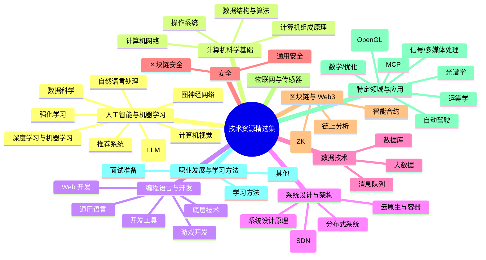
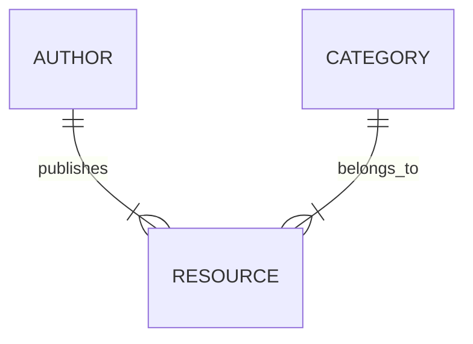
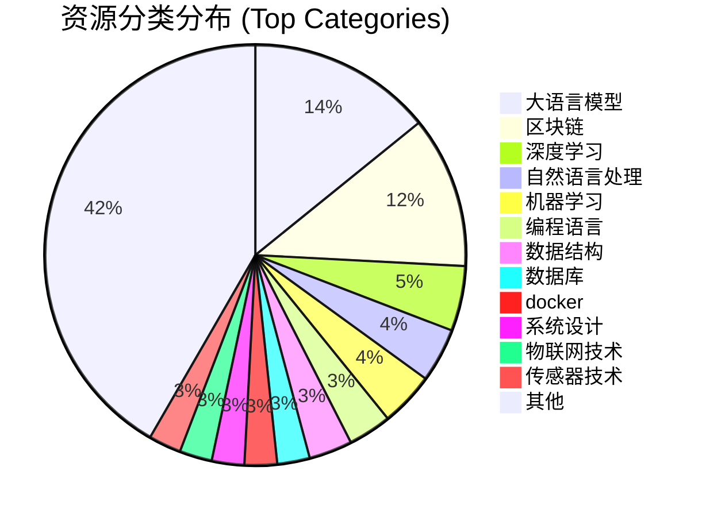
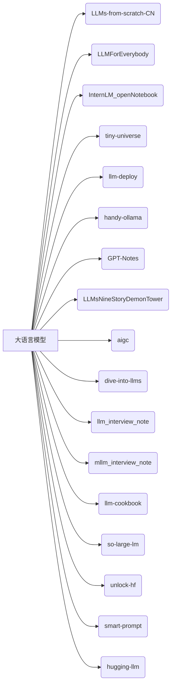

# 📚 Awesome-AI-IT-LearningResource

欢迎来到我的技术资源精选集！这里汇集了我在学习和工作中收藏的 GitHub 仓库、技术笔记、在线书籍等优秀资源，涵盖了计算机科学、人工智能、软件开发、系统架构等多个领域。希望这份列表也能对您的学习和探索有所帮助。

然后我把以下大部分资源都上传到了我们搭建的平台技术社区-灏天文库里，可以在线查看和学习，里面还包含了更多的学习资源，助力你在互联网的成长。

**灏天文库：技术知识库，专注于机器学习、编程、大数据等领域的学习资源。**

# 🚀 Awesome-AI-IT-LearningResource: 你的进阶加油站！

还在为在浩瀚的技术海洋中寻找高质量的学习资源而迷失方向吗？

欢迎来到 [1044197988/Awesome-AI-IT-LearningResource] 的精选技术资源宝库！🚀 这里汇集了我从入门到实战、从理论到实践过程中，精心收藏和筛选的一系列**GitHub 开源项目、技术笔记、在线书籍及教程**。它们涵盖了 **计算机科学、人工智能、软件开发、系统架构** 等互联网技术领域的关键知识点。

这份列表旨在为你提供一份清晰的学习路线图和可靠的参考资料集，帮助你：

*   🎯 **快速定位** 特定技术方向的优质资源
*   📖 **系统学习** 核心理论和实践技能
*   🔧 **解决问题** 时找到灵感和解决方案
*   💡 **拓宽视野** 了解前沿技术动态

**但仅仅是链接列表还不够！** 为了提供更**流畅、便捷**的学习体验，并收录更多**体系化、深入化**的内容，我特别搭建了一个专注于技术深度探索与成长的在线社区和知识库平台——**灏天文库**。

---

## ✨ 探索更多精彩内容：[灏天文库](https://www.aiknowledge.cn)  

**灏天文库** 是一个精心打造的技术知识平台，**专注于机器学习、编程、大数据、系统架构**等核心技术领域的**高质量学习资源**。在这里，你可以找到：

*   **本 GitHub 列表中绝大部分资源的在线版本**，排版优化，阅读体验更佳。
*   **海量额外精选的学习路径、技术专栏、实战教程**，持续更新。
*   **系统性的知识组织**，帮助你构建完整的技术图谱。
*   **一个共同学习、交流成长的技术社区。**

无论你是刚踏入技术领域的萌新，还是寻求突破和深入的资深开发者，灏天文库都致力于成为你互联网技术成长旅途中的得力助手和可靠伙伴。

### 1. 资源分类概览 (Mindmap)

这个思维导图展示了资源的顶级分类结构，让您可以快速了解主要涵盖的技术领域。

*说明：这个思维导图展示了资源收集的主要技术分类及其子分类，帮助您一览资源的广度。*

### 2. 资源、作者、分类关系 (Entity-Relationship Diagram)

这个 ER 图展示了资源（Resource）、作者（Author）和分类（Category）之间的抽象关系。

*说明：一个作者可以发布多个资源 (`publishes`)，一个分类可以包含多个资源 (`belongs_to`)。这是数据结构的一种抽象表示。*

### 3. 主要资源分类分布 (Pie Chart)

这个饼状图展示了您收集的资源在主要技术分类上的大致分布比例。为了图表简洁，这里选取了出现次数较多的几个分类，并将其他合并。

*说明：该图显示了不同技术领域资源的数量分布。请注意，这里的统计是基于您提供的列表中每行主分类的计数，一个资源可能被列在多个分类下，或者同一个作者的笔记涵盖多个分类（在原始列表中显示为同一个GitHub名称下多个分类）。“其他”分类包含了所有出现次数较少的分类的总和。*

### 4. 特定分类资源列表 (Flowchart)

以“大语言模型”分类为例，这个流程图展示了该分类下的具体资源项目。您可以点击节点链接直接访问资源地址。

*说明：此流程图展示了“大语言模型”分类下的所有资源项目，节点上的文字是资源的简称或GitHub仓库名。点击每个资源节点可以直接跳转到对应的链接。您可以将此图替换为或复制并修改为其他您感兴趣的分类的资源列表展示。*

---

**资源分类:**

*   [人工智能与机器学习](#人工智能与机器学习)
    *   [大语言模型 (LLM) 与生成式 AI](#大语言模型-llm-与生成式-ai)
    *   [深度学习与机器学习](#深度学习与机器学习)
    *   [计算机视觉与图像处理](#计算机视觉与图像处理)
    *   [自然语言处理 (NLP)](#自然语言处理-nlp)
    *   [强化学习](#强化学习)
    *   [推荐系统](#推荐系统)
    *   [图神经网络](#图神经网络)
    *   [数据科学与分析](#数据科学与分析)
*   [计算机科学基础](#计算机科学基础)
    *   [操作系统](#操作系统)
    *   [计算机网络](#计算机网络)
    *   [数据结构与算法](#数据结构与算法)
    *   [计算机组成原理](#计算机组成原理)
*   [编程语言与开发](#编程语言与开发)
    *   [通用编程语言](#通用编程语言)
    *   [Web 开发](#web-开发)
    *   [游戏开发与编程](#游戏开发与编程)
    *   [底层技术 (JVM, Source Code)](#底层技术-jvm-source-code)
    *   [开发效率工具 (Git, Vim, Bash)](#开发效率工具-git-vim-bash)
*   [系统设计与架构](#系统设计与架构)
    *   [系统设计原理](#系统设计原理)
    *   [云原生与容器 (Kubernetes, Docker)](#云原生与容器-kubernetes-docker)
    *   [网络架构 (SDN)](#网络架构-sdn)
    *   [分布式系统](#分布式系统)
*   [数据技术](#数据技术)
    *   [数据库 (SQL, 图数据库)](#数据库-sql-图数据库)
    *   [大数据](#大数据)
    *   [消息队列 (Kafka)](#消息队列-kafka)
*   [安全](#安全)
    *   [通用安全](#通用安全)
    *   [区块链安全](#区块链安全)
*   [区块链与 Web3](#区块链与-web3)
    *   [智能合约与开发](#智能合约与开发)
    *   [零知识证明 (ZK)](#零知识证明-zk)
    *   [链上分析](#链上分析)
*   [物联网与传感器](#物联网与传感器)
*   [特定领域与应用](#特定领域与应用)
    *   [自动驾驶](#自动驾驶)
    *   [光谱学](#光谱学)
    *   [信号与多媒体处理](#信号与多媒体处理)
    *   [数学与优化](#数学与优化)
    *   [图形学 (OpenGL)](#图形学-opengl)
    *   [MCP](#mcp)
    *   [运筹学](#运筹学)
*   [职业发展与学习方法](#职业发展与学习方法)
    *   [面试准备](#面试准备)
    *   [学习方法与指南](#学习方法与指南)
    *   [其他](#其他)

---

### 人工智能与机器学习

#### 大语言模型 (LLM) 与生成式 AI

| 名称 (Description)                                                         | 作者 (Author)       | 地址 (Link)                                                                      |
| :------------------------------------------------------------------------- | :------------------ | :------------------------------------------------------------------------------- |
| LLMs-from-scratch项目中文翻译                                              | MLNLP-World         | [Link](https://github.com/MLNLP-World/LLMs-from-scratch-CN?tab=License-1-ov-file#readme) |
| 每个人都能看懂的大模型知识分享，LLMs秋招大模型面试前必看，让你和面试官侃侃而谈       | luhengshiwo         | [Link](https://github.com/luhengshiwo/LLMForEverybody/tree/main)                 |
| 书生·浦语 (InternLM) 开源大语言模型第一期课程笔记                                 | SaaRaaS-1300        | [Link](https://github.com/SaaRaaS-1300/InternLM_openNotebook/tree/main)          |
| 《大模型白盒子构建指南》：一个全手搓的Tiny-Universe                                | datawhalechina      | [Link](https://github.com/datawhalechina/tiny-universe)                          |
| 大模型/LLM推理和部署理论与实践                                                   | datawhalechina      | [Link](https://github.com/datawhalechina/llm-deploy/tree/main)                   |
| 基于模块化图的检索增强生成（RAG）系统 (GraphRAG)                             | microsoft           | [Link](https://github.com/microsoft/graphrag)                                    |
| Phi-3 CookBook                                                             | microsoft           | [Link](https://github.com/microsoft/Phi-3CookBook/tree/main)                     |
| WTF Langchain                                                              | WTFAcademy          | [Link](https://github.com/WTFAcademy/WTF-Langchain)                              |
| 生成式AI入门教程                                                           | microsoft           | [Link](https://github.com/microsoft/generative-ai-for-beginners/tree/main)       |
| GPT系统提示以及各种提示注入/泄露知识的集合。                                       | LouisShark          | [Link](https://github.com/LouisShark/chatgpt_system_prompt/tree/main)            |
| 使用 OpenAI 的 GPT-4 等大型语言模型的提示和技巧。 (Prompt Engineering)           | brexhq              | [Link](https://github.com/brexhq/prompt-engineering)                             |
| 用于快速工程设计的指南、论文、讲座、笔记本和资源 (PayloadsAllTheThings)            | swisskyrepo         | [Link](https://github.com/swisskyrepo/PayloadsAllTheThings/tree/master)          |
| handy-ollama                                                               | Datawhale           | [Link](https://github.com/datawhalechina/handy-ollama/tree/main)                 |
| GPT笔记                                                                    | gotonote            | [Link](https://github.com/gotonote/GPT-Notes/tree/main)                          |
| 【LLMs 入门实战系列】LLMsNineStoryDemonTower                                | km1994 杨夕         | [Link](https://github.com/km1994/LLMsNineStoryDemonTower)                      |
| 《构筑大语言模型应用：应用开发与架构设计》                                            | phodal              | [Link](https://github.com/phodal/aigc/tree/master)                               |
| 《动手学大模型深入LLM》系列编程实践教程                                             | Lordog              | [Link](https://github.com/Lordog/dive-into-llms/tree/main)                       |
| 主要记录大语言大模型（LLMs） 算法（应用）工程师相关的知识及面试题 (llm_interview_note) | wdnev               | [Link](https://github.com/wdndev/llm_interview_note/tree/main)                   |
| 主要记录大语言大模型（LLMs） 算法（应用）工程师多模态相关知识 (mllm_interview_note)    | wdnev               | [Link](https://github.com/wdndev/mllm_interview_note/tree/main)                  |
| 面向开发者的大模型手册 - LLM Cookbook                                          | Datawhale           | [Link](https://github.com/datawhalechina/llm-cookbook/tree/main)                 |
| 大模型理论基础 (so-large-lm)                                                 | Datawhale           | [Link](https://github.com/datawhalechina/so-large-lm/tree/main)                  |
| Unlock-HuggingFace                                                         | Datawhale           | [Link](https://github.com/datawhalechina/unlock-hf)                              |
| “听话的”提示词构建教程 (smart-prompt)                                         | Datawhale           | [Link](https://github.com/datawhalechina/smart-prompt)                           |
| HuggingLLM, Hugging Future.                                                | Datawhale           | [Link](https://github.com/datawhalechina/hugging-llm)                            |

#### 深度学习与机器学习

| 名称 (Description)                               | 作者 (Author)       | 地址 (Link)                                                                  |
| :----------------------------------------------- | :------------------ | :--------------------------------------------------------------------------- |
| 动手学深度学习                                   | d2l-ai              | [Link](https://github.com/d2l-ai/d2l-zh)                                     |
| 斯坦福大学2014（吴恩达）机器学习教程中文笔记     | fengdu78            | [Link](https://github.com/fengdu78/Coursera-ML-AndrewNg-Notes)               |
| 机器学习-自然语言处理学习 (ML-NLP)               | mantchs             | [Link](https://github.com/NLP-LOVE/ML-NLP)                                   |
| 《动手学习深度学习》 (DeepLearning-MuLi-Notes)   | MLNLP-World         | [Link](https://github.com/MLNLP-World/DeepLearning-MuLi-Notes/tree/main)     |
| 《PyTorch深度学习实践》笔记 (Pytorch-Deep-Learning-Practice-Notes) | MLNLP-World         | [Link](https://github.com/MLNLP-World/Pytorch-Deep-Learning-Practice-Notes)  |
| 《Deep Learning Tuning Playbook》中文翻译版本    | ytzfhqs             | [Link](https://github.com/ytzfhqs/Deep-Learning-Tuning-Playbook-CN)          |
| 人工智能入门教程                                 | microsoft           | [Link](https://github.com/microsoft/AI-For-Beginners/tree/main)              |
| 机器学习入门教程                                 | microsoft           | [Link](https://github.com/microsoft/ML-For-Beginners/tree/main)              |
| 《机器学习》（西瓜书）公式详解 (pumpkin-book)    | Datawhale           | [Link](https://github.com/datawhalechina/pumpkin-book/tree/main)             |
| 水很深的深度学习 (unusual-deep-learning)         | Datawhale           | [Link](https://github.com/datawhalechina/unusual-deep-learning)              |
| 李航老师的《统计学习方法》习题解答 (statistical-learning-method-solutions-manual) | Datawhale           | [Link](https://github.com/datawhalechina/statistical-learning-method-solutions-manual/tree/master) |
| 钥匙书 Key-book-《机器学习理论导引》             | Datawhale           | [Link](https://github.com/datawhalechina/key-book)                           |
| 模型压缩的小白入门教程 (awesome-compression)     | Datawhale           | [Link](https://github.com/datawhalechina/awesome-compression/tree/main)      |
| 人工智能教育资源                                 | microsoft           | [Link](https://github.com/microsoft/ai-edu/tree/master)                      |

#### 计算机视觉与图像处理

| 名称 (Description)         | 作者 (Author)   | 地址 (Link)                                                              |
| :------------------------- | :-------------- | :----------------------------------------------------------------------- |
| 动手学CV-Pytorch版         | Datawhale       | [Link](https://github.com/datawhalechina/dive-into-cv-pytorch)           |
| OpenCV教程-Python          | CodecWang       | [Link](https://github.com/CodecWang/opencv-python-tutorial)              |
| 面经，内容包括机器学习，CV，NLP，推荐，开发 | Datawhale       | [Link](https://github.com/datawhalechina/daily-interview/tree/master)    |

#### 自然语言处理 (NLP)

| 名称 (Description)                                                     | 作者 (Author)       | 地址 (Link)                                                                      |
| :--------------------------------------------------------------------- | :------------------ | :------------------------------------------------------------------------------- |
| 自然语言处理入门                                                       | HanLP作者           | [Link](https://github.com/NLP-LOVE/Introduction-NLP/tree/master)                 |
| 机器学习-自然语言处理学习 (ML-NLP)                                     | mantchs             | [Link](https://github.com/NLP-LOVE/ML-NLP)                                       |
| 【关于 NLP】百问百答 (NLP-Interview-Notes)                             | km1994 杨夕         | [Link](https://github.com/km1994/NLP-Interview-Notes)                            |
| Datawhale组队学习中“自然语言处理”方向的资料 (team-learning-nlp)        | Datawhale           | [Link](https://github.com/datawhalechina/team-learning-nlp/tree/master)          |
| 基于transformers的自然语言处理(NLP)入门 (learn-nlp-with-transformers) | Datawhale           | [Link](https://github.com/datawhalechina/learn-nlp-with-transformers/tree/main)  |
| 面经，内容包括机器学习，CV，NLP，推荐，开发                                  | Datawhale           | [Link](https://github.com/datawhalechina/daily-interview/tree/master)            |

#### 强化学习

| 名称 (Description)           | 作者 (Author)   | 地址 (Link)                                                              |
| :--------------------------- | :-------------- | :----------------------------------------------------------------------- |
| 强化学习中文教程（蘑菇书）   | Datawhale       | [Link](https://github.com/datawhalechina/easy-rl/tree/master)            |
| DeepRL                       | AmazingAng      | [Link](https://github.com/AmazingAng/WTF-DeepRL/tree/master)             |
| JoyRL Book                   | Datawhale       | [Link](https://github.com/datawhalechina/joyrl-book/tree/main)           |

#### 推荐系统

| 名称 (Description)                       | 作者 (Author)   | 地址 (Link)                                                              |
| :--------------------------------------- | :-------------- | :----------------------------------------------------------------------- |
| 推荐系统学习 (RS_paper_study)            | km1994 杨夕     | [Link](https://github.com/km1994/RS_paper_study)                         |
| 推荐系统 (fun-rec)                       | Datawhale       | [Link](https://github.com/datawhalechina/fun-rec/tree/master)            |
| 面经，内容包括机器学习，CV，NLP，推荐，开发 | Datawhale       | [Link](https://github.com/datawhalechina/daily-interview/tree/master)    |

#### 图神经网络

| 名称 (Description)         | 作者 (Author)   | 地址 (Link)                                                              |
| :------------------------- | :-------------- | :----------------------------------------------------------------------- |
| GCN学习 (GCN_study)        | km1994 杨夕     | [Link](https://github.com/km1994/GCN_study)                              |
| 图深度学习（葡萄书）(grape-book) | Datawhale       | [Link](https://github.com/datawhalechina/grape-book/tree/main)           |

#### 数据科学与分析

| 名称 (Description)                               | 作者 (Author)   | 地址 (Link)                                                              |
| :----------------------------------------------- | :-------------- | :----------------------------------------------------------------------- |
| 数据科学的笔记以及资料搜集 (Data-Science-Notes)  | fengdu78        | [Link](https://github.com/fengdu78/Data-Science-Notes)                   |
| 数据科学入门教程                                 | microsoft       | [Link](https://github.com/microsoft/Data-Science-For-Beginners/tree/main) |

---

### 计算机科学基础

#### 操作系统

| 名称 (Description)           | 作者 (Author)       | 地址 (Link)                                                        |
| :--------------------------- | :------------------ | :----------------------------------------------------------------- |
| 计算机专业笔记               | SSHeRun Thrinity    | [Link](https://github.com/SSHeRun/CS-Xmind-Note)                   |
| 《理解Linux进程》开源电子书  | tobegit3hub         | [Link](https://github.com/tobegit3hub/understand_linux_process/tree/master) |
| Bash入门教程                 | microsoft           | [Link](https://github.com/microsoft/bash-for-beginners)            |
| 技术面试必备基础知识... (CS-Notes) | CyC2018             | [Link](https://github.com/CyC2018/CS-Notes/tree/master)            |
| 计算机基础面试问题全面总结 (Waking-Up) | wolverinn           | [Link](https://github.com/wolverinn/Waking-Up)                     |

#### 计算机网络

| 名称 (Description)               | 作者 (Author)    | 地址 (Link)                                                        |
| :------------------------------- | :--------------- | :----------------------------------------------------------------- |
| 计算机专业笔记                   | SSHeRun Thrinity | [Link](https://github.com/SSHeRun/CS-Xmind-Note)                   |
| 【译】网络思考 (think-os-zh)       | wizardforcel     | [Link](https://github.com/wizardforcel/think-os-zh/tree/master)    |
| 技术面试必备基础知识... (CS-Notes) | CyC2018          | [Link](https://github.com/CyC2018/CS-Notes/tree/master)            |
| 计算机基础面试问题全面总结 (Waking-Up) | wolverinn        | [Link](https://github.com/wolverinn/Waking-Up)                     |
| 《设计数据密集型应用程序》DDIA中文翻译 | Vonng            | [Link](https://github.com/Vonng/ddia)                              |
| 【开源书籍】深入讲解内核网络...    | isno             | [Link](https://github.com/isno/theByteBook/tree/theByteBook)       |

#### 数据结构与算法

| 名称 (Description)                                     | 作者 (Author)       | 地址 (Link)                                                                      |
| :----------------------------------------------------- | :------------------ | :------------------------------------------------------------------------------- |
| 计算机专业笔记                                         | SSHeRun Thrinity    | [Link](https://github.com/SSHeRun/CS-Xmind-Note)                                 |
| 《代码随想录》LeetCode 刷题攻略 (leetcode-master)      | youngyangyang04     | [Link](https://github.com/youngyangyang04/leetcode-master/tree/master)           |
| 用 JavaScript 实现的算法和数据结构... (javascript-algorithms) | trekhleb            | [Link](https://github.com/trekhleb/javascript-algorithms)                        |
| 刷算法全靠套路 (fucking-algorithm)                     | labuladong          | [Link](https://github.com/labuladong/fucking-algorithm/tree/master)              |
| 《Hello算法》：动画图解、一键运行的数据结构与算法教程    | krahets             | [Link](https://github.com/krahets/hello-algo)                                    |
| 技术面试必备基础知识... (CS-Notes)                     | CyC2018             | [Link](https://github.com/CyC2018/CS-Notes/tree/master)                          |
| 计算机基础面试问题全面总结 (Waking-Up)                 | wolverinn           | [Link](https://github.com/wolverinn/Waking-Up)                                   |

#### 计算机组成原理

| 名称 (Description)   | 作者 (Author)    | 地址 (Link)                                                        |
| :------------------- | :--------------- | :----------------------------------------------------------------- |
| 计算机专业笔记       | SSHeRun Thrinity | [Link](https://github.com/SSHeRun/CS-Xmind-Note)                   |
| 计算机基础面试问题全面总结 (Waking-Up) | wolverinn        | [Link](https://github.com/wolverinn/Waking-Up)                     |

---

### 编程语言与开发

#### 通用编程语言

| 名称 (Description)                     | 作者 (Author)      | 地址 (Link)                                                          |
| :------------------------------------- | :----------------- | :------------------------------------------------------------------- |
| 《Clang Compiler Frontend》的非专业个人翻译 | xiaoweiChen        | [Link](https://github.com/xiaoweiChen/Clang-Compiler-Frontend)       |
| JavaGuide 「Java学习+面试指南」...     | Snailclimb         | [Link](https://github.com/Snailclimb/JavaGuide)                      |
| CPP Notes                              | gotonote           | [Link](https://github.com/gotonote/CPP-Notes)                        |
| Lua Primer                             | andycai            | [Link](https://github.com/andycai/luaprimer/tree/master)             |
| Go 教程                                | jaywcjlove         | [Link](https://github.com/jaywcjlove/golang-tutorial)                |
| Swift 教程                             | jaywcjlove         | [Link](https://github.com/jaywcjlove/swift-tutorial)                 |
| Rust语言圣经                           | sunface            | [Link](https://github.com/sunface/rust-course)                       |
| WTF Rust                               | WTFAcademy         | [Link](https://github.com/WTFAcademy/WTF-Rust)                       |
| WTF JavaScript                         | WTFAcademy         | [Link](https://github.com/WTFAcademy/WTF-JavaScript/tree/main)       |
| Python入门教程                         | microsoft          | [Link](https://github.com/microsoft/c9-python-getting-started/tree/master?tab=readme-ov-file) |
| JavaScript/Node入门教程                | microsoft          | [Link](https://github.com/microsoft/beginners-intro-javascript-node) |
| Python - 100天从新手到大师             | jackfrued          | [Link](https://github.com/jackfrued/Python-100-Days/tree/master)     |
| kotlin 官方文档翻译                  | huanglizhuo        | [Link](https://github.com/huanglizhuo/kotlin-in-chinese/tree/master) |
| GO语言高级编程                         | chai2010           | [Link](https://github.com/chai2010/advanced-go-programming-book)     |
| 技术面试必备基础知识... (CS-Notes)     | CyC2018            | [Link](https://github.com/CyC2018/CS-Notes/tree/master)              |

#### Web 开发

| 名称 (Description)                 | 作者 (Author)   | 地址 (Link)                                                              |
| :--------------------------------- | :-------------- | :----------------------------------------------------------------------- |
| WTF HTML                           | WTFAcademy      | [Link](https://github.com/WTFAcademy/WTF-HTML)                           |
| WTF CSS                            | WTFAcademy      | [Link](https://github.com/WTFAcademy/WTF-CSS)                            |
| Web 开发入门教程                   | microsoft       | [Link](https://github.com/microsoft/Web-Dev-For-Beginners/tree/main)     |
| swiftui example                    | jaywcjlove      | [Link](https://github.com/jaywcjlove/swiftui-example)                    |
| 千古前端图文教程...做一名精致优雅的前端工程师。 | qianguyihao     | [Link](https://github.com/qianguyihao/Web/tree/master)                   |
| 全栈工程师手册                     | heibaiying      | [Link](https://github.com/heibaiying/Full-Stack-Notes)                   |

#### 游戏开发与编程

| 名称 (Description)                 | 作者 (Author)   | 地址 (Link)                                                              |
| :--------------------------------- | :-------------- | :----------------------------------------------------------------------- |
| 从零编写游戏引擎教程... (cpp-game-engine-book) | ThisisGame      | [Link](https://github.com/ThisisGame/cpp-game-engine-book/tree/main)     |
| 游戏程序员生涯的读书笔记合辑       | QianMo          | [Link](https://github.com/QianMo/Game-Programmer-Study-Notes/tree/master) |
| XR Development For Beginners       | microsoft       | [Link](https://github.com/microsoft/xr-development-for-beginners)        |

#### 底层技术 (JVM, Source Code)

| 名称 (Description)                   | 作者 (Author)   | 地址 (Link)                                                                |
| :----------------------------------- | :-------------- | :------------------------------------------------------------------------- |
| Java 虚拟机底层原理知识总结 (jvm)    | doocs           | [Link](https://github.com/doocs/jvm/tree/main)                             |
| 互联网公司常用框架源码赏析 (source-code-hunter) | doocs           | [Link](https://github.com/doocs/source-code-hunter)                        |
| 互联网 Java 工程师进阶知识完全扫盲... (advanced-java) | doocs           | [Link](https://github.com/doocs/advanced-java/tree/main)                   |

#### 开发效率工具 (Git, Vim, Bash)

| 名称 (Description)                 | 作者 (Author)   | 地址 (Link)                                                        |
| :--------------------------------- | :-------------- | :----------------------------------------------------------------- |
| Git 菜单 (git-recipes)             | geeeeeeeeeek    | [Link](https://github.com/geeeeeeeeek/git-recipes?tab=readme-ov-file) |
| Vim 实践教程（学习 Vi 和 Vims）    | dofy            | [Link](https://github.com/dofy/learn-vim/tree/master)              |
| Bash Handbook                      | denysdovhan     | [Link](https://github.com/denysdovhan/bash-handbook/tree/master?tab=License-1-ov-file) |
| Shell 教程                         | jaywcjlove      | [Link](https://github.com/jaywcjlove/shell-tutorial)               |
| Bash入门教程                       | microsoft       | [Link](https://github.com/microsoft/bash-for-beginners)            |
| 计算机基础面试问题全面总结 (Waking-Up) | wolverinn       | [Link](https://github.com/wolverinn/Waking-Up)                     |

---

### 系统设计与架构

#### 系统设计原理

| 名称 (Description)                                           | 作者 (Author)       | 地址 (Link)                                                              |
| :----------------------------------------------------------- | :------------------ | :----------------------------------------------------------------------- |
| 系统设计 (阿秀学习笔记)                                      | 阿秀                | [Link](https://interviewguide.cn/notes/03-hunting_job/02-interview/05-01-01-distribution.html) |
| 了解如何设计大型系统...准备系统设计面试。(system-design-primer) | donnemartin         | [Link](https://github.com/donnemartin/system-design-primer/tree/master)  |
| 使用视觉对象和简单术语解释复杂系统...帮助您准备系统设计面试。(system-design-101) | ByteByteGoHq        | [Link](https://github.com/ByteByteGoHq/system-design-101/tree/main)      |
| 技术面试必备基础知识...系统设计 (CS-Notes)                   | CyC2018             | [Link](https://github.com/CyC2018/CS-Notes/tree/master)                  |
| 《设计数据密集型应用程序》DDIA中文翻译                         | Vonng               | [Link](https://github.com/Vonng/ddia)                                    |
| 基于《大话设计模式》对设计原则和设计模式进行解读 (sweetalk-design-pattern) | Datawhale           | [Link](https://github.com/datawhalechina/sweetalk-design-pattern/tree/main) |
| 【开源书籍】深入讲解内核网络...等云原生相关技术              | isno                | [Link](https://github.com/isno/theByteBook/tree/theByteBook)           |

#### 云原生与容器 (Kubernetes, Docker)

| 名称 (Description)                                     | 作者 (Author) | 地址 (Link)                                                              |
| :----------------------------------------------------- | :------------ | :----------------------------------------------------------------------- |
| Kubernetes中文指南/云原生应用架构实战手册 (kubernetes-handbook) | rootsongjc    | [Link](https://github.com/rootsongjc/kubernetes-handbook/tree/master)    |
| docker中文文档                                         | widuu         | [Link](https://github.com/widuu/chinese_docker)                          |
| Kubernetes 手册（Kubernetes 指南）                     | feiskyer      | [Link](https://github.com/feiskyer/kubernetes-handbook/tree/master)      |
| docker 教程                                            | jaywcjlove    | [Link](https://github.com/jaywcjlove/docker-tutorial)                    |
| 通过真正的 DevOps 实践来学习和理解 Docker&Container 技术！ | yeasy         | [Link](https://github.com/yeasy/docker_practice/tree/master)             |
| 【开源书籍】深入讲解内核网络...等云原生相关技术          | isno          | [Link](https://github.com/isno/theByteBook/tree/theByteBook)           |

#### 网络架构 (SDN)

| 名称 (Description)         | 作者 (Author) | 地址 (Link)                                                              |
| :------------------------- | :------------ | :----------------------------------------------------------------------- |
| SDN网络指南（SDN手册）     | feiskyer      | [Link](https://github.com/feiskyer/sdn-handbook/tree/master?tab=License-1-ov-file) |

---

### 数据技术

#### 数据库 (SQL, 图数据库)

| 名称 (Description)               | 作者 (Author)    | 地址 (Link)                                                              |
| :------------------------------- | :--------------- | :----------------------------------------------------------------------- |
| 数据库 (gavin-james)             | gavin-james      | [Link](https://gavin-james.github.io/db/sql/sql-db.html)                 |
| 计算机专业笔记                   | SSHeRun Thrinity | [Link](https://github.com/SSHeRun/CS-Xmind-Note)                         |
| 图数据库                         | XAI嬴图          | [Link](https://zhuanlan.zhihu.com/p/8829373323)                          |
| Mysql 教程                       | jaywcjlove       | [Link](https://github.com/jaywcjlove/mysql-tutorial)                     |
| 技术面试必备基础知识... (CS-Notes) | CyC2018          | [Link](https://github.com/CyC2018/CS-Notes/tree/master)                  |
| 计算机基础面试问题全面总结 (Waking-Up) | wolverinn        | [Link](https://github.com/wolverinn/Waking-Up)                     |
| 《设计数据密集型应用程序》DDIA中文翻译 | Vonng            | [Link](https://github.com/Vonng/ddia)                              |

#### 大数据

| 名称 (Description)           | 作者 (Author) | 地址 (Link)                                                              |
| :--------------------------- | :------------ | :----------------------------------------------------------------------- |
| 大数据入门指南               | heibaiying    | [Link](https://github.com/heibaiying/BigData-Notes)                      |
| 大数据处理导论教程 (juicy-bigdata) | Datawhale     | [Link](https://github.com/datawhalechina/juicy-bigdata/tree/master)      |

#### 消息队列 (Kafka)

| 名称 (Description)     | 作者 (Author) | 地址 (Link)                                                              |
| :--------------------- | :------------ | :----------------------------------------------------------------------- |
| kafka 文档中文翻译     | apachecn      | [Link](https://github.com/apachecn/kafka-doc-zh/tree/master)             |
| 《设计数据密集型应用程序》DDIA中文翻译 | Vonng       | [Link](https://github.com/Vonng/ddia)                              |

---

### 安全

#### 通用安全

| 名称 (Description)             | 作者 (Author)       | 地址 (Link)                                                        |
| :----------------------------- | :------------------ | :----------------------------------------------------------------- |
| 计算机专业笔记                 | SSHeRun Thrinity    | [Link](https://github.com/SSHeRun/CS-Xmind-Note)                   |
| Auth 相关笔记                  | wx-chevalier        | [Link](https://github.com/wx-chevalier/Auth-Notes/tree/master)     |
| Security 101                   | microsoft           | [Link](https://github.com/microsoft/Security-101)                  |
| 安全手册，企业安全实践与安全研究知识库 | SEC-CAFE            | [Link](https://github.com/SEC-CAFE/handbook/tree/main)             |

#### 区块链安全

| 名称 (Description)                           | 作者 (Author) | 地址 (Link)                                                              |
| :------------------------------------------- | :------------ | :----------------------------------------------------------------------- |
| EOS 智能合约最佳安全开发指南                 | slowmist      | [Link](https://github.com/slowmist/eos-smart-contract-security-best-practices) |
| 基于区块链的加密货币安全审计指南             | slowmist      | [Link](https://github.com/slowmist/Cryptocurrency-Security-Audit-Guide/tree/main) |
| 区块链黑暗森林自我防护手册。                 | slowmist      | [Link](https://github.com/slowmist/Blockchain-dark-forest-selfguard-handbook/tree/main) |
| 加密资产安全解决方案 加密货币安全解决方案    | slowmist      | [Link](https://github.com/slowmist/cryptocurrency-security/tree/main)    |
| Cairo 0 安全审计实践指南                     | slowmist      | [Link](https://github.com/slowmist/Cairo0-Security-Audit-Practice-Guide) |
| APTOS MOVE 智能合约审计入门                  | slowmist      | [Link](https://github.com/slowmist/APTOS-MOVE-Smart-Contract-Auditing-Primer) |
| 知识库 慢雾安全团队知识库                    | slowmist      | [Link](https://github.com/slowmist/Knowledge-Base/tree/master)           |
| Dune 的区块链数据分析教程... (WTF-Onchain-Analysis) | WTFAcademy    | [Link](https://github.com/WTFAcademy/WTF-Onchain-Analysis)               |

---

### 区块链与 Web3

| 名称 (Description)                                                 | 作者 (Author) | 地址 (Link)                                                                  |
| :----------------------------------------------------------------- | :------------ | :--------------------------------------------------------------------------- |
| EOS 智能合约最佳安全开发指南                                       | slowmist      | [Link](https://github.com/slowmist/eos-smart-contract-security-best-practices) |
| 基于区块链的加密货币安全审计指南                                   | slowmist      | [Link](https://github.com/slowmist/Cryptocurrency-Security-Audit-Guide/tree/main) |
| WTF Solidity 极简入门教程                                          | AmazingAng    | [Link](https://github.com/AmazingAng/WTF-Solidity/tree/main)                 |
| WTF Dapp                                                           | WTFAcademy    | [Link](https://github.com/WTFAcademy/WTF-Dapp/tree/main)                     |
| WTF Cairo                                                          | WTFAcademy    | [Link](https://github.com/WTFAcademy/WTF-Cairo)                              |
| WTF EVM Opcodes                                                    | WTFAcademy    | [Link](https://github.com/WTFAcademy/WTF-EVM-Opcodes)                        |
| WTF zkSync                                                         | WTFAcademy    | [Link](https://github.com/WTFAcademy/WTF-zkSync)                             |
| WTF Vyper                                                          | WTFAcademy    | [Link](https://github.com/WTFAcademy/WTF-Vyper)                              |
| WTF web3py                                                         | WTFAcademy    | [Link](https://github.com/WTFAcademy/WTF-web3py)                             |
| 区块链黑暗森林自我防护手册。                                       | slowmist      | [Link](https://github.com/slowmist/Blockchain-dark-forest-selfguard-handbook/tree/main) |
| 加密资产安全解决方案                                               | slowmist      | [Link](https://github.com/slowmist/cryptocurrency-security/tree/main)        |
| Cairo 0 安全审计实践指南                                           | slowmist      | [Link](https://github.com/slowmist/Cairo0-Security-Audit-Practice-Guide)     |
| APTOS MOVE 智能合约审计入门                                        | slowmist      | [Link](https://github.com/slowmist/APTOS-MOVE-Smart-Contract-Auditing-Primer) |
| WTF Solidity Internals                                             | WTFAcademy    | [Link](https://github.com/WTFAcademy/WTF-Solidity-Internals/tree/master)     |
| WTF Ethers                                                         | WTFAcademy    | [Link](https://github.com/WTFAcademy/WTF-Ethers?tab=License-1-ov-file)       |
| Huff极简教程，学习编写优化的智能合约。 (WTF-Huff)                    | WTFAcademy    | [Link](https://github.com/WTFAcademy/WTF-Huff/tree/main)                     |
| Dune 的区块链数据分析教程，由 SixdegreeLab 维护。提供英文和 中文 版本。 (WTF-Onchain-Analysis) | WTFAcademy    | [Link](https://github.com/WTFAcademy/WTF-Onchain-Analysis)               |

#### 零知识证明 (ZK)

| 名称 (Description)               | 作者 (Author) | 地址 (Link)                                                        |
| :------------------------------- | :------------ | :----------------------------------------------------------------- |
| 零知识证明入门教程... (WTF-zk)   | WTFAcademy    | [Link](https://github.com/WTFAcademy/WTF-zk/tree/main)             |
| zk-SNARK Groth16 详解            | slowmist      | [Link](https://github.com/slowmist/zkSnark-Groth16-Getting-Started) |
| WTF zkSync                       | WTFAcademy    | [Link](https://github.com/WTFAcademy/WTF-zkSync)                   |

---

### 物联网与传感器

| 名称 (Description)           | 作者 (Author)       | 地址 (Link)                                                              |
| :--------------------------- | :------------------ | :----------------------------------------------------------------------- |
| 车载传感器 自动驾驶技术      | lovebetterworld     | [Link](https://github.com/is-whale/autonomours_blog/tree/master)         |
| 传感器记录器                 | tszheichoi          | [Link](https://github.com/tszheichoi/awesome-sensor-logger/tree/main)    |
| 智能传感器 (IEEE-1451-study) | Staok               | [Link](https://github.com/Staok/IEEE-1451-study/tree/main)               |
| 物联网MQTT协议               | mcxiaoke            | [Link](https://github.com/mcxiaoke/mqtt/tree/master)                     |
| 对 IoT 进行编程              | LabbenchStudios 工作室 | [Link](https://github.com/programming-the-iot/book-exercise-docs/tree/default) |
| 教你设计物联网系统。构建自己的Internet of Things (designiot) | phodal              | [Link](https://github.com/phodal/designiot/tree/gh-pages)                |
| 物联网入门教程               | microsoft           | [Link](https://github.com/microsoft/IoT-For-Beginners/tree/main)         |

---

### 特定领域与应用

#### 自动驾驶

| 名称 (Description)       | 作者 (Author)   | 地址 (Link)                                                            |
| :----------------------- | :-------------- | :--------------------------------------------------------------------- |
| 车载传感器 自动驾驶技术  | lovebetterworld | [Link](https://github.com/is-whale/autonomours_blog/tree/master)       |
| 自动驾驶笔记 (Autopilot-Updating-Notes) | gotonote        | [Link](https://github.com/gotonote/Autopilot-Notes)                    |

#### 光谱学

| 名称 (Description)     | 作者 (Author) | 地址 (Link)                                                                  |
| :--------------------- | :------------ | :--------------------------------------------------------------------------- |
| 波长选择               | Fu Pengyou    | [Link](https://github.com/FuSiry/Wavelength-selection)                       |
| 天文光谱学             | Chang Liu     | [Link](https://github.com/slowdivePTG/Notes/tree/master/Astronomical%20Spectroscopy) |

#### 信号与多媒体处理

| 名称 (Description)                     | 作者 (Author)     | 地址 (Link)                                                          |
| :------------------------------------- | :---------------- | :------------------------------------------------------------------- |
| 高级数字信号处理笔记本和教程           | TUIlmenauAMS      | [Link](https://github.com/TUIlmenauAMS/ADSP_Tutorials)               |
| 音频信号处理的深度学习                 | TUIlmenauAMS      | [Link](https://github.com/TUIlmenauAMS/AES_Tutorial_2021)            |
| 音频编码视频教程和 Python 笔记本       | TUIlmenauAMS      | [Link](https://github.com/TUIlmenauAMS/AudioCoding_Tutorials)        |
| MRSP 教程                              | TUIlmenauAMS      | [Link](https://github.com/TUIlmenauAMS/MRSP_Tutorials)               |
| 视频编码 (Videocoding)                 | TUIlmenauAMS      | [Link](https://github.com/TUIlmenauAMS/Videocoding)                  |
| GVT Lecture Colab                      | TUIlmenauAMS      | [Link](https://github.com/TUIlmenauAMS/GVT_Lecture_Colab/tree/main)  |
| MLfAS 教程                             | TUIlmenauAMS      | [Link](https://github.com/TUIlmenauAMS/MLfAS_Tutorials)              |

#### 数学与优化

| 名称 (Description)     | 作者 (Author)   | 地址 (Link)                                                              |
| :--------------------- | :-------------- | :----------------------------------------------------------------------- |
| 最优网络流传输         | AXIOMZK         | [Link](https://github.com/AXIOMZK/cdn)                                   |
| 数据分布 (distribution-is-all-you-need) | graykode        | [Link](https://github.com/graykode/distribution-is-all-you-need)         |
| 数学建模导论           | Datawhale       | [Link](https://github.com/datawhalechina/intro-mathmodel/tree/main)      |
| 运筹学优化             | Datawhale       | [Link](https://github.com/datawhalechina/undingable-optimization/tree/main?tab=readme-ov-file) |

#### 图形学 (OpenGL)

| 名称 (Description)   | 作者 (Author)    | 地址 (Link)                                                        |
| :------------------- | :--------------- | :----------------------------------------------------------------- |
| OpenGL教程           | zilongshanren    | [Link](https://github.com/zilongshanren/opengl-tutorials/tree/master) |

#### MCP

| 名称 (Description)   | 作者 (Author) | 地址 (Link)                                                              |
| :------------------- | :------------ | :----------------------------------------------------------------------- |
| Awesome MCP Servers  | punkpeye      | [Link](https://github.com/punkpeye/awesome-mcp-servers/tree/main)        |

#### 运筹学

| 名称 (Description)   | 作者 (Author) | 地址 (Link)                                                              |
| :------------------- | :------------ | :----------------------------------------------------------------------- |
| 运筹学优化         | Datawhale     | [Link](https://github.com/datawhalechina/undingable-optimization/tree/main?tab=readme-ov-file) |

---

### 职业发展与学习方法

#### 面试准备

| 名称 (Description)                                             | 作者 (Author)       | 地址 (Link)                                                                  |
| :------------------------------------------------------------- | :------------------ | :--------------------------------------------------------------------------- |
| 成为软件工程师的完整计算机科学研究计划。(coding-interview-university) | jwasham             | [Link](https://github.com/jwasham/coding-interview-university)                 |
| 准备行为面试的提示和资源。(awesome-behavioral-interviews)        | ashishps1           | [Link](https://github.com/ashishps1/awesome-behavioral-interviews)           |
| 面经，内容包括机器学习，CV，NLP，推荐，开发                        | Datawhale           | [Link](https://github.com/datawhalechina/daily-interview/tree/master)        |
| 计算机基础（计算机网络/操作系统/数据库/Git...）面试问题全面总结... (Waking-Up) | wolverinn           | [Link](https://github.com/wolverinn/Waking-Up)                                 |
| 技术面试必备基础知识、Leetcode、计算机操作系统、计算机网络、系统设计 (CS-Notes) | CyC2018             | [Link](https://github.com/CyC2018/CS-Notes/tree/master)                        |
| 了解如何设计大型系统。准备系统设计面试。(system-design-primer)       | donnemartin         | [Link](https://github.com/donnemartin/system-design-primer/tree/master)      |
| 使用视觉对象和简单术语解释复杂系统。帮助您准备系统设计面试。(system-design-101) | ByteByteGoHq        | [Link](https://github.com/ByteByteGoHq/system-design-101/tree/main)          |

#### 学习方法与指南

| 名称 (Description)                                     | 作者 (Author)   | 地址 (Link)                                                              |
| :----------------------------------------------------- | :-------------- | :----------------------------------------------------------------------- |
| 教你如何正确地提出技术问题并获得你满意的答案             | ryanhanwu       | [Link](https://github.com/ryanhanwu/How-To-Ask-Questions-The-Smart-Way)  |
| 别像弱智一样提问 (Stop-Ask-Questions-The-Stupid-Ways)    | tangx           | [Link](https://github.com/tangx/Stop-Ask-Questions-The-Stupid-Ways)      |
| 《动手做科研》面向科研初学者，一步一步地展示如何入门人工智能科研 | WengLean        | [Link](https://github.com/WengLean/hands-on-research-tutorial)           |
| 计算机自学指南                                         | PKUFlyingPig    | [Link](https://github.com/PKUFlyingPig/cs-self-learning)                 |

#### 其他

| 名称 (Description)             | 作者 (Author) | 地址 (Link)                                                              |
| :----------------------------- | :------------ | :----------------------------------------------------------------------- |
| Devops 练习                    | bregman-arie  | [Link](https://github.com/bregman-arie/devops-exercises?tab=readme-ov-file) |
| DevOps 指南 - 从开发到生产的所有配置... | Tikam02       | [Link](https://github.com/Tikam02/DevOps-Guide)                          |
| Crawler Tutorial               | NanmiCoder    | [Link](https://github.com/NanmiCoder/CrawlerTutorial/tree/main)          |
| Markdown·简单的世界              | wizardforcel  | [Link](https://github.com/wizardforcel/markdown-simple-world/tree/master) |
| 程序员长寿指南                 | geekan        | [Link](https://github.com/geekan/HowToLiveLonger?tab=Unlicense-1-ov-file) |
| WTF CTF                        | WTFAcademy    | [Link](https://github.com/WTFAcademy/WTF-CTF/tree/main)                  |
| WTF gm                         | WTFAcademy    | [Link](https://github.com/WTFAcademy/WTF-gm)                             |

---

## 贡献

如果您有其他优秀的资源希望添加到这个列表中，欢迎通过 Pull Request 的方式贡献。请确保您提交的资源符合现有分类，或者提出新的分类建议。

## 许可

本项目采用 MIT License 开源。

